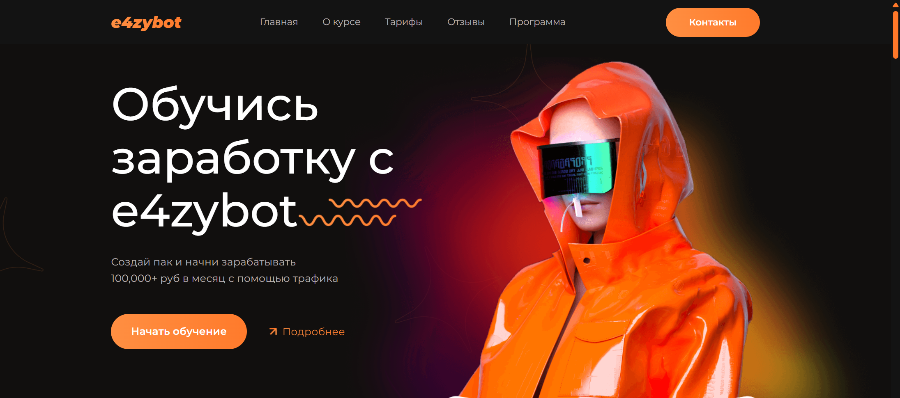
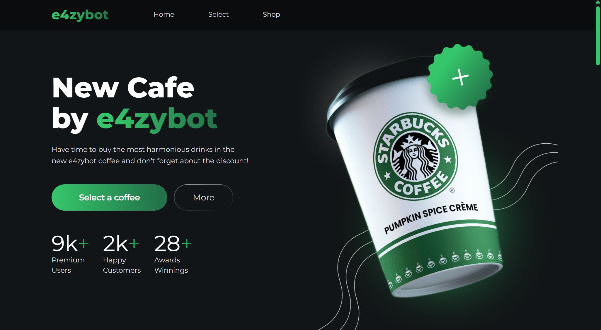
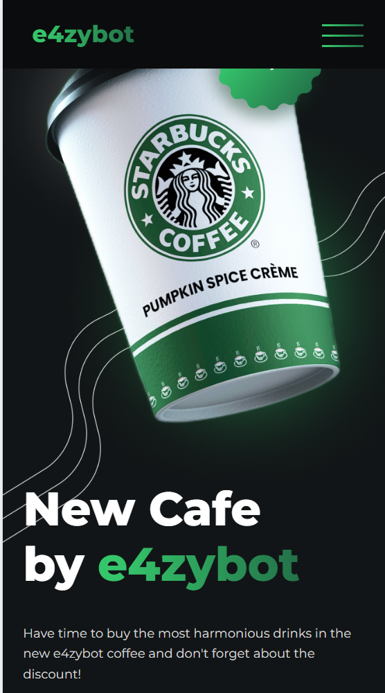
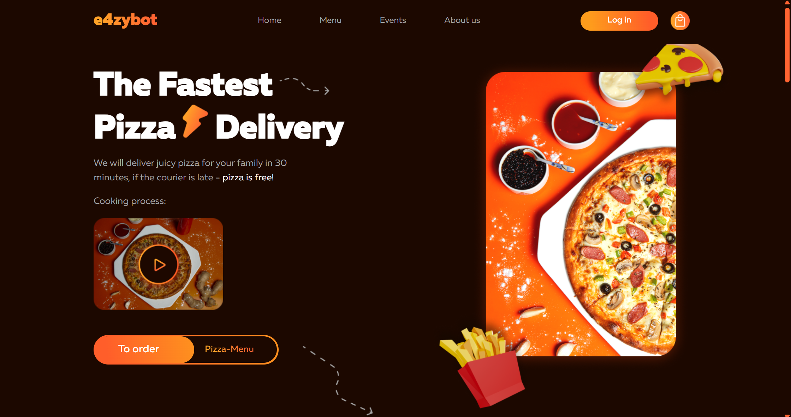
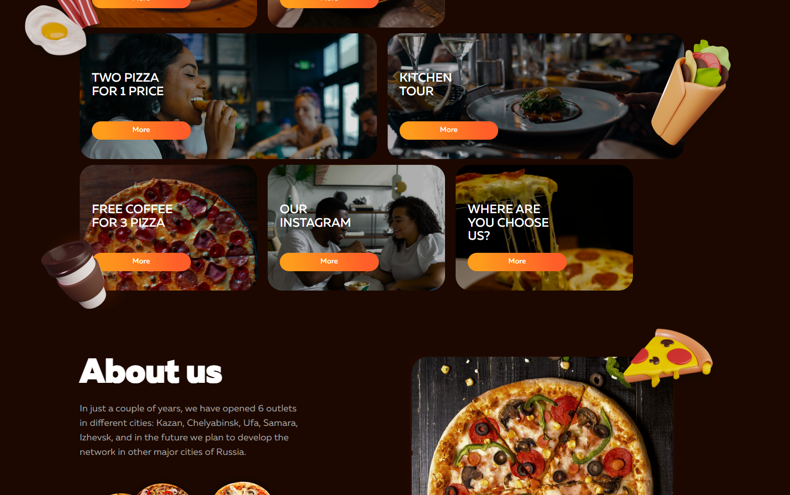
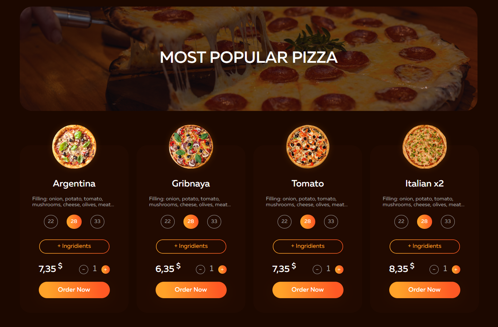
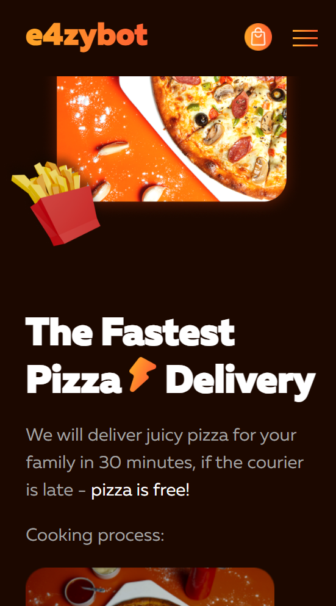

# 🔥 Слив топовых фронтенд-макетов (чистый HTML/CSS/JS)  
**Автор:** [e4zybot](https://t.me/e4zybot) *(мой телеграм-бот для того чтобы гнать трафик на стикерах!)*  

4 крутых лендинга + 1 сервис с **кастомным дизайном, анимациями и адаптивом**. Всё на чистом фронтенде — берите, меняйте контент и используйте как основу для своих проектов.  

---

## 📦 Что в сливе?  

### 1. **NFT Course Landing**  
- Одностраничник для курса по NFT с плавными переходами и hover-эффектами.  
- Адаптив под мобилки + анимация на CSS.  

**Скриншоты:**  
  
<!--    -->

---

### 2. **Starbucks Clone**  
- Стилизованный под Starbucks лендинг с интерактивным меню и темной темой.  
- CSS-анимации при скролле.  

**Скриншоты:**  
  
  

---

### 3. **Онлайн-гарант сервис**  
- Интерфейс для гарант-сервиса с формами, модалками и валидацией.  
- Адаптивные таблицы и кнопки с микроинтеракциями.  

**Скриншоты:**  
  
<!--    -->

---

### 4. **Пиццерия**  
- Лендинг с 3D-эффектами для пиццерии (параллакс, анимация ингредиентов).  
- Mobile-first вёрстка.  

**Скриншоты:**  
  
  
  
  
---

### 5. **Магазин парфюма**  
- Элегантный лендинг с сеткой товаров, фильтрами и CSS-переходами.  
- Кастомный слайдер на ванильном JS.  

**Скриншоты:**  
  
<!--    -->

---

**Бесплатный трафик на ваши проекты!** [@e4zybot](https://t.me/e4zybot) 🤩  

[@e4zybot](https://t.me/e4zybot) 🧩 Ищете способ увеличить свою аудиторию? Создайте стикеры и эмодзи! 🚀  

🔒 Скопируйте стикеры или эмодзи через [@e4zybot](https://t.me/e4zybot), вставьте в название свой канал и раскрутите пак.  

⏱ Готово! Теперь у вас есть не только свои стикеры и эмодзи [@emojis4](https://t.me/emojis4), но и аудитория с них!  

⚡️ [@e4zybot](https://t.me/e4zybot) ⚡️  
⚡️ [@e4zybot](https://t.me/e4zybot) ⚡️  
⚡️ [@e4zybot](https://t.me/e4zybot) ⚡️  

**Создание стикеров ещё никогда не было НАСТОЛЬКО простым.**